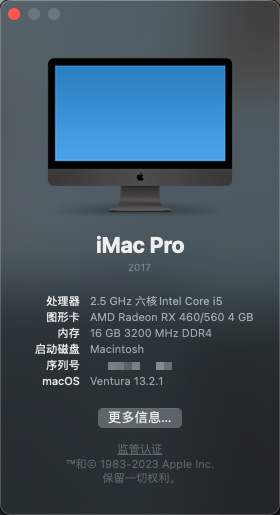
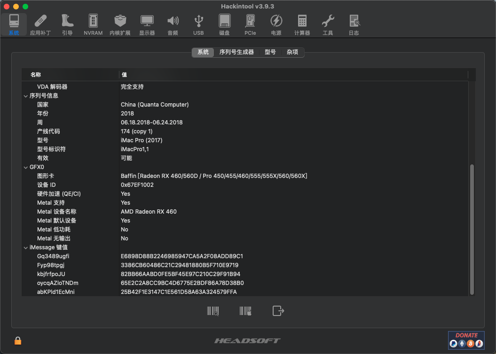
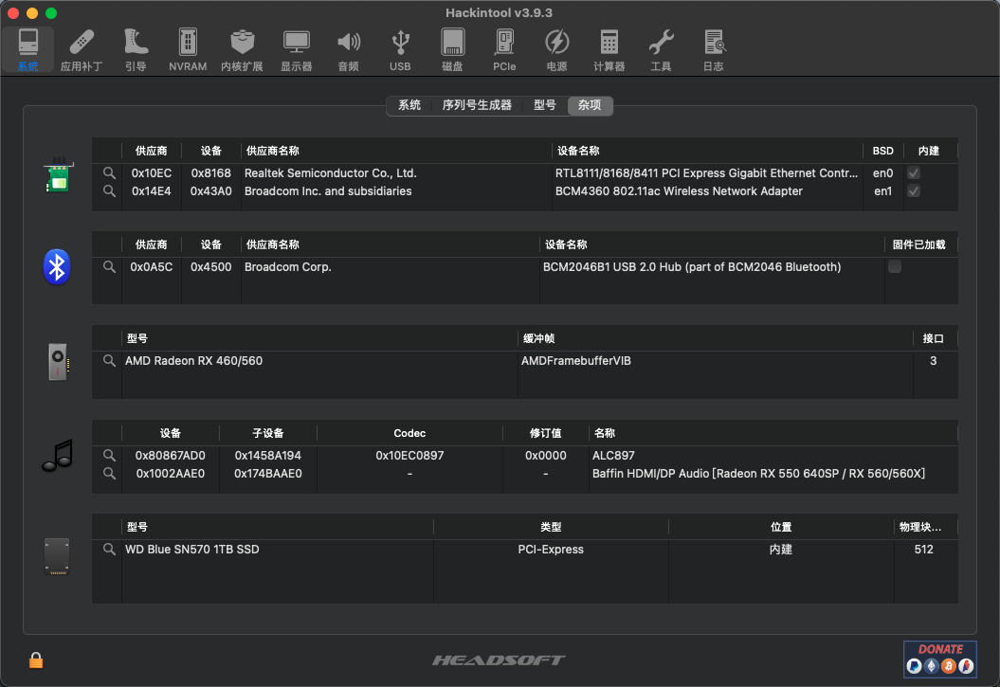
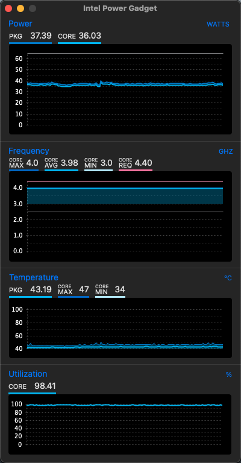

# Hackintosh-EFI-GIGABYTE-H610M-H

## 介绍  
[Hackintosh-EFI-GIGABYTE-H610M-H](https://github.com/byakkili/Hackintosh-H610M-12400-RX460)

## 说明  
GIGABYTE-H610M-H 的黑苹果 EFI，当前支持 Ventura 13(b)

* release: 稳定版本. 

## 配置  
 配置     | 型号
 ---------|--------
 主板     | 技嘉（GIGABYTE）H610M H DDR4
 处理器   | 英特尔 Core i5-12400 @ 2.50GHz 六核
 内存     | 16 GB ( 金士顿 DDR4 3200MHz 16GB x 1 )
 硬盘     | 西数 WD_Blue SN570 1000GB ( 1 TB / 固态硬盘 )
 显卡     | AMD Radeon RX 460 ( 4 GB / 蓝宝石 )
 无线网卡 | 博通® BCM94360CSA ( PCI-E接口 )
 有线网卡 | Realtek RTL8111
 声卡     | Realtek ALC 897

 ## 预览
    
 
 
  